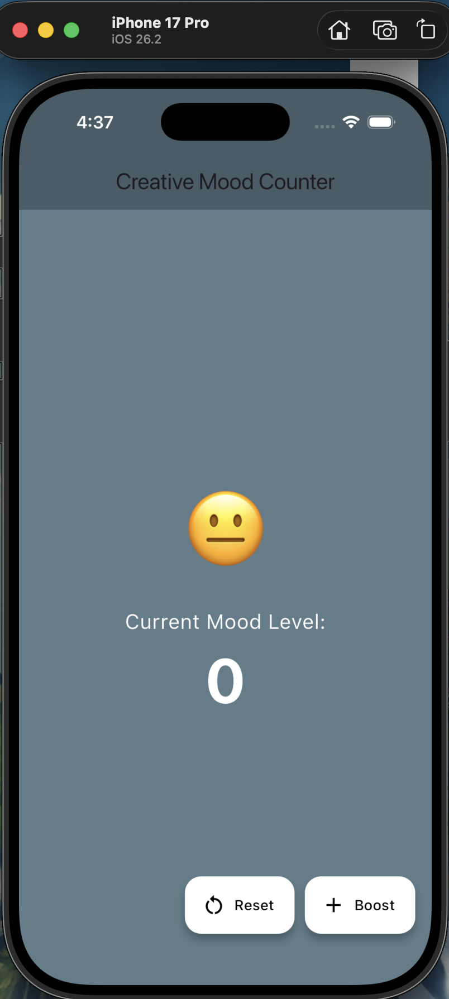
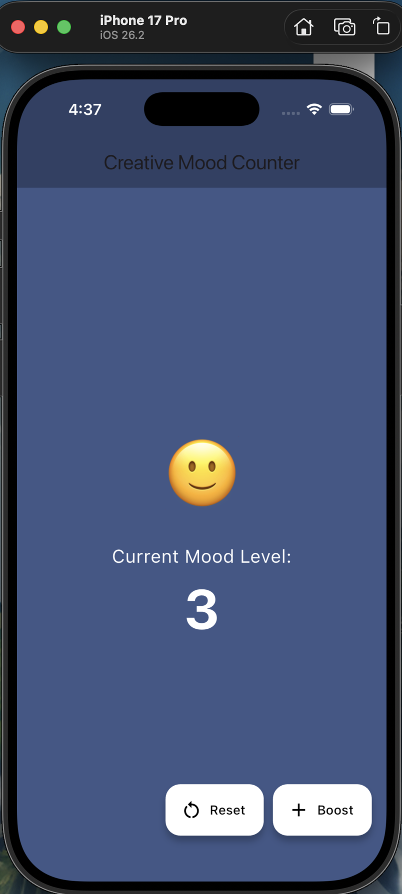
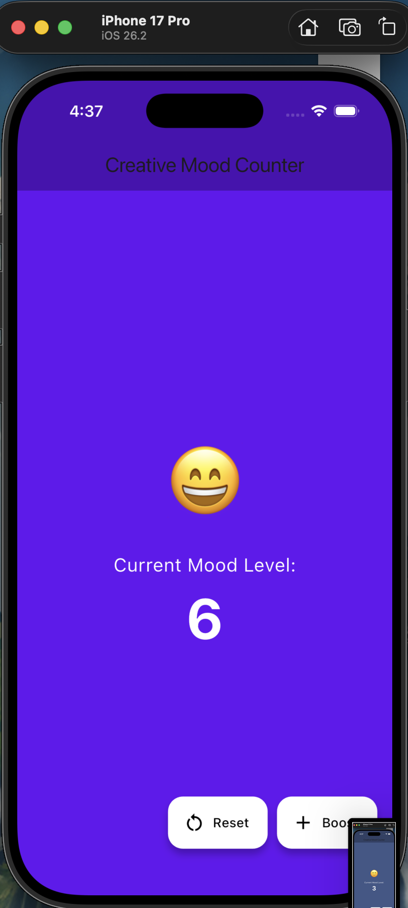
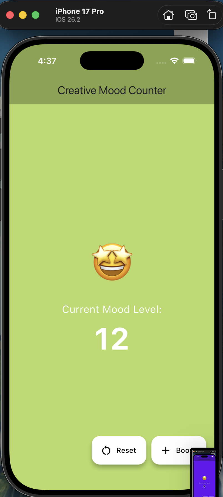
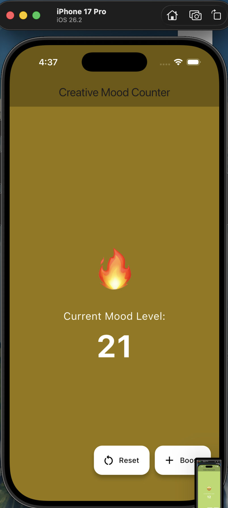

🌈 Interactive Mood Counter (Flutter setState Demo)
A creative exploration of State Management in Flutter. This app demonstrates how to use the setState() method to rebuild the UI dynamically based on user interaction, featuring a "Mood Boost" mechanic with visual feedback.

🎯 Objective
To strengthen the understanding of StatefulWidgets by creating a fun, interactive experience where a single state change triggers multiple UI updates simultaneously.

🛠️ How it Works: The setState() Logic
The heart of the app lies in the _InteractiveCounterState class. When a button is pressed, the following flow occurs:

Event Trigger: User taps the "Boost" or "Reset" button.

State Modification: Inside the setState(() { ... }) block, variables like _counter, _bgColor, and _mood are updated.

UI Rebuild: setState() signals the Flutter framework that the internal state has changed.

Framework Response: Flutter calls the build() method again, painting the screen with the new values.

📱Screenshots

