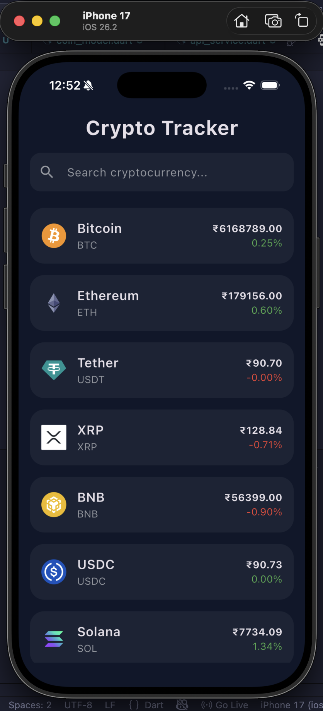
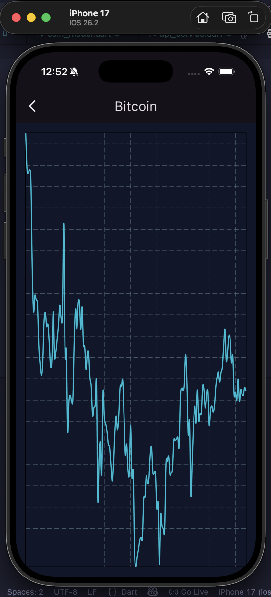
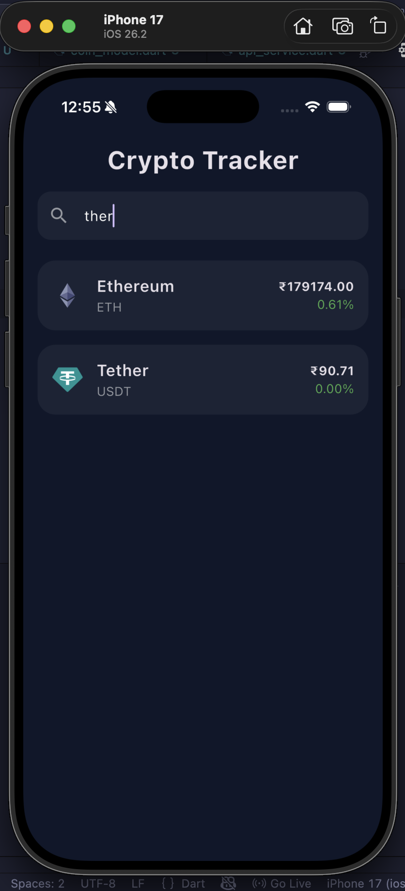

# Crypto Price Tracker App

This Flutter application is a REST API–driven crypto price tracker that fetches real-time cryptocurrency data from the CoinGecko public API.

## Features
- Live cryptocurrency prices in INR
- Search functionality to filter coins
- Pull-to-refresh support
- 7-day price trend chart using fl_chart
- Loading indicators and error handling
- Clean and responsive dark-themed UI

## Technologies Used
- Flutter
- http (for API calls)
- fl_chart (for trend graph)
- intl (for formatting)

## API Used
CoinGecko Public API:
https://api.coingecko.com/api/v3/

## Learning Outcomes
- REST API integration
- JSON parsing and data modeling
- Asynchronous programming in Flutter
- State management using FutureBuilder
- Dynamic UI updates with real-time data

This project demonstrates backend communication, data handling, and interactive UI design in Flutter.

## Screenshots

  
  
  

