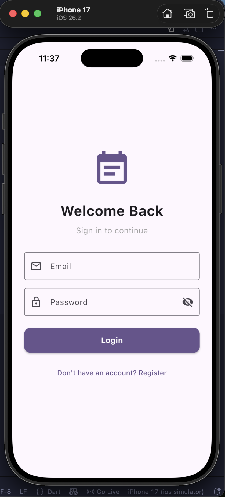
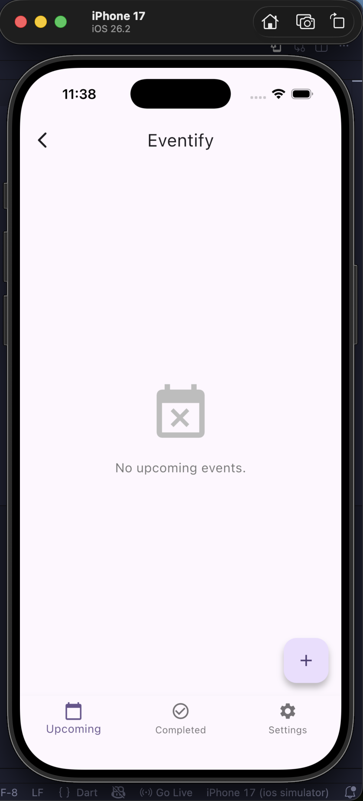
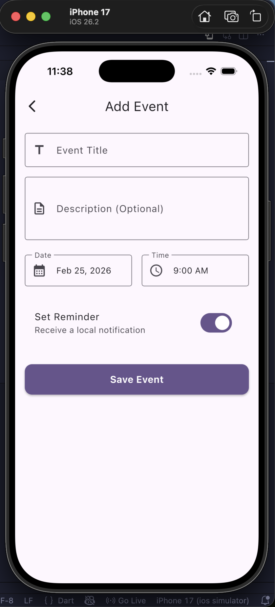
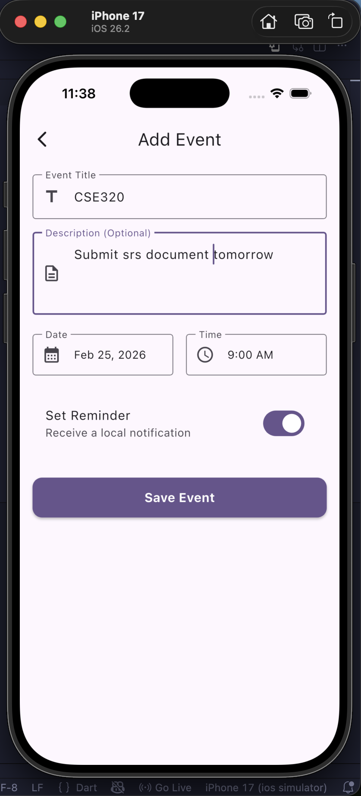
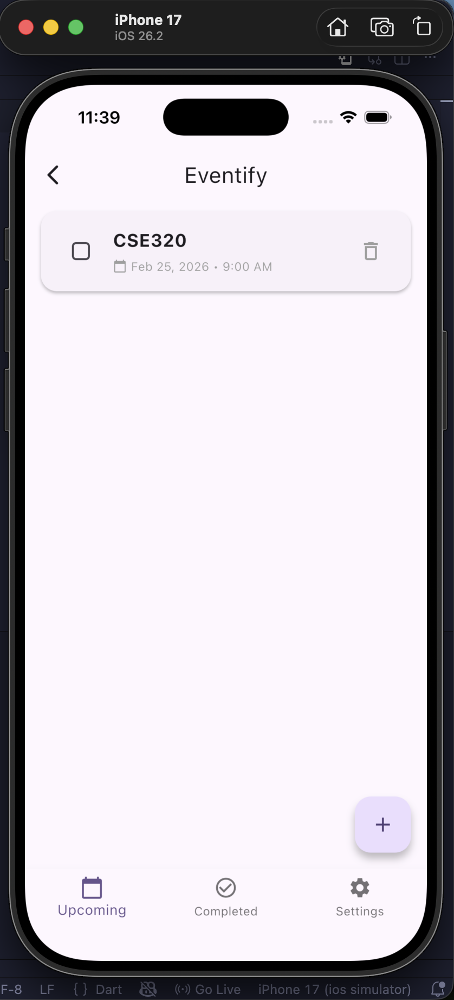
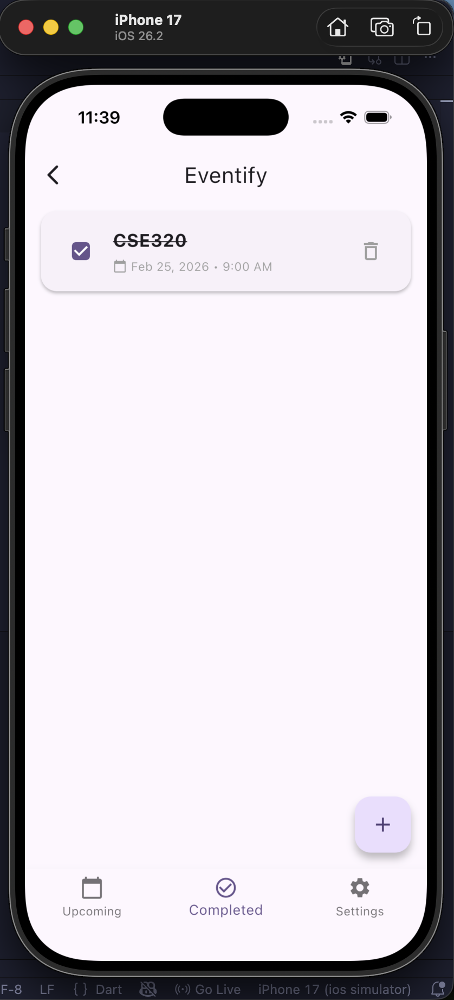

# Eventify

Eventify is a robust, clean architecture Flutter application that allows users to create, view, manage, and delete events with scheduled local notifications.

## Features
- **Local Authentication**: Basic secure authentication using `flutter_secure_storage`.
- **Event Management**: Add, view, update, delete, and mark events as complete.
- **Local Storage**: Completely offline DB implemented using NoSQL `hive` storage.
- **Local Notifications**: Scheduled event notifications powered by `flutter_local_notifications` and `timezone` handling, fully compatible with Android 13+ and iOS.
- **Material 3 UI**: Modern, responsive, and dark-mode-ready design scheme.
- **State Management**: Uses `provider` for structured and testable component isolation.

## Technical Setup
1. Ensure you have the Flutter SDK (>= 3.11).
2. Run `flutter pub get`.
3. Launch with `flutter run`.

## Structure
- `models/`: Contains the data models mapping to local storage.
- `providers/`: Handles application state separating UI from business logic.
- `services/`: Encapsulates interactions with Hive APIs and plugins.
- `screens/`: Hosts route views like Splash, Login, Home, etc.
- `widgets/`: Configurable and reusable component primitives.

## Screenshots

  
  
  
  
  
  

