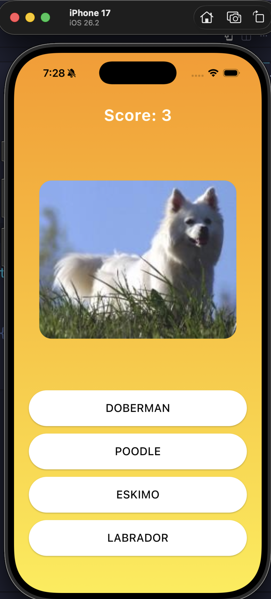
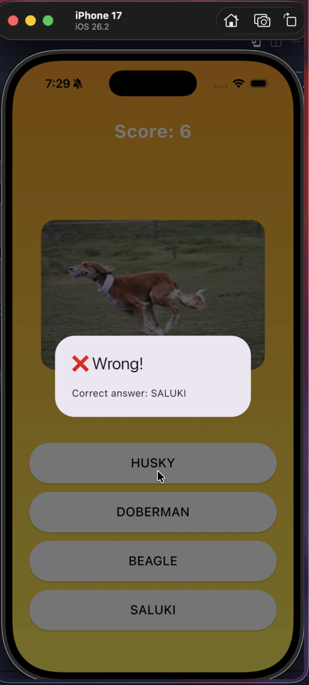
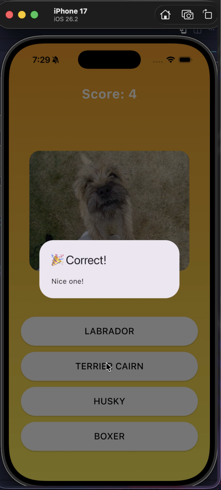

# Guess The Dog Breed 🐶🎮

A fun, gamified Flutter mini‑game where players guess the breed of a randomly displayed dog image. Each round shows a dog photo and four breed options. Select the correct answer to increase your score and trigger a celebration animation. The game automatically loads the next question, creating a continuous quiz experience.

## Features

* Random dog images fetched from an online API
* Multiple‑choice quiz gameplay
* Score tracking
* Animated feedback (confetti on correct answers)
* Responsive full‑screen UI
* Continuous rounds (no manual refresh needed)

## Packages Used

* **http** – Fetches random dog images from the Dog CEO API
* **confetti** – Displays celebration animation for correct answers

## ScreenShot

  
  
  

