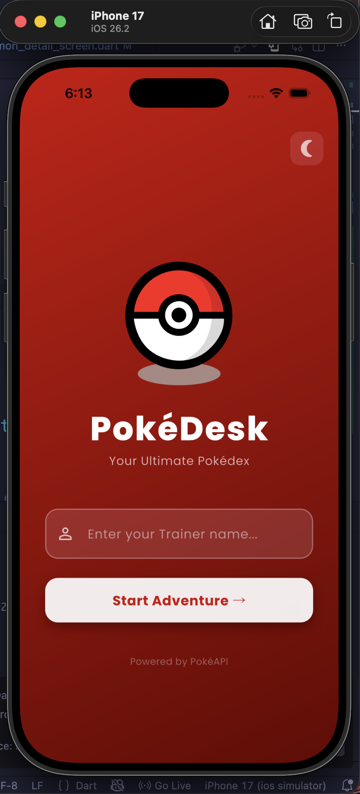
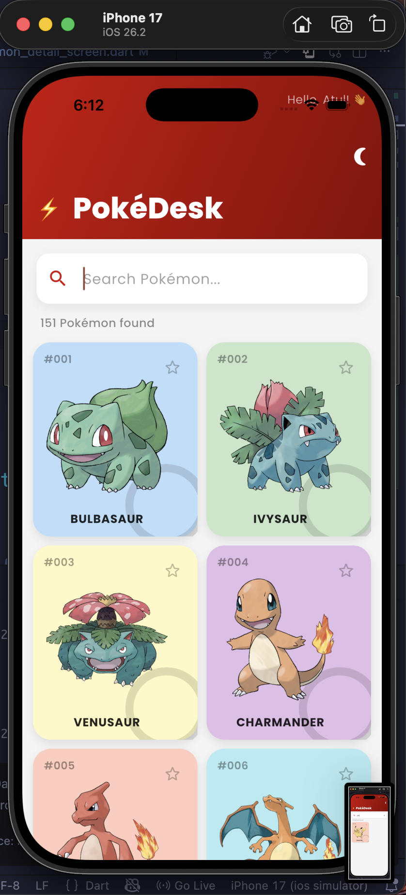
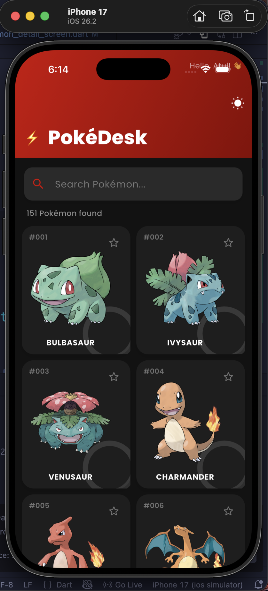
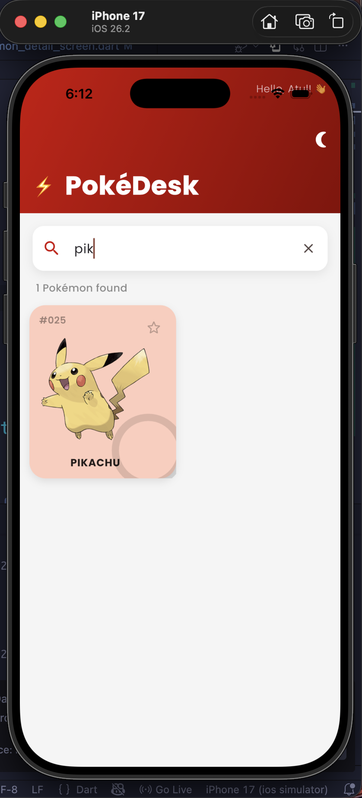
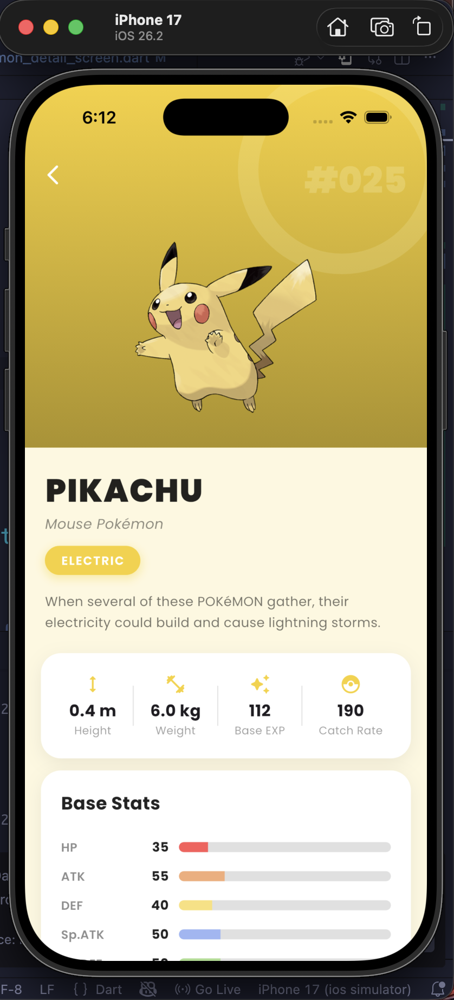
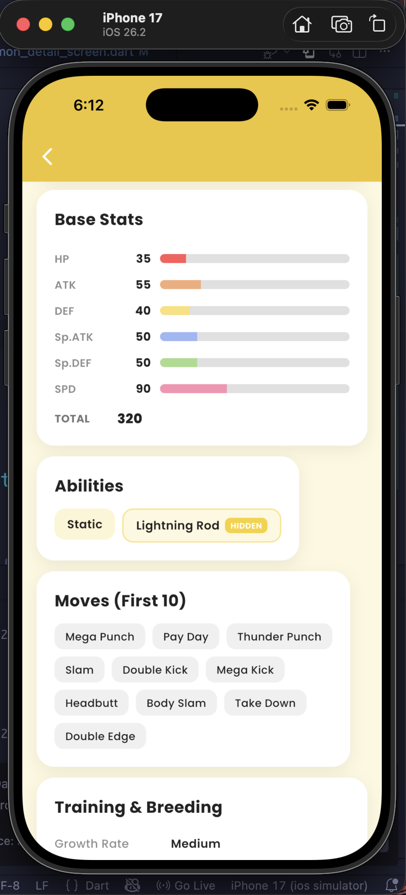

# 🧢 Poképedia App

Poképedia is a creative Flutter-based Pokédex app that fetches real-time Pokémon data from the PokéAPI. The app features a fun animated login screen and a clean, responsive interface designed for smooth user experience.

## 🚀 Features

- 🎬 Login screen with Lottie animation  
- 🔍 Search Pokémon by name  
- 📋 Grid view of Pokémon with images  
- ⭐ Favorite Pokémon toggle  
- 🌙 Dark mode support  
- 📖 Detailed Pokémon screen (height, weight, abilities)  
- 🔄 Real-time API fetching using setState()  

## 🛠 Packages Used

- `http` – Fetch Pokémon data from PokéAPI  
- `lottie` – Animated login screen  
- `google_fonts` – Modern typography  
- `flutter_spinkit` – Loading animations  

## 🌐 API Used

Data is fetched from:  
https://pokeapi.co

## 💡 Highlights

The app focuses on creativity, clean UI design, responsive layouts, and smooth navigation. It demonstrates API integration, state management using setState(), and interactive UI elements.

---

Built with Flutter 💙

## ScreenShots

  
  
  
  
  
  

